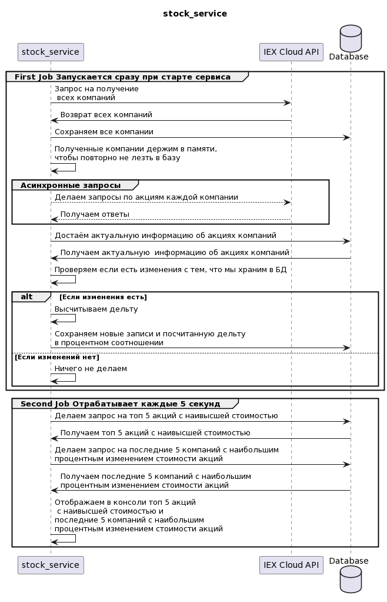

### stocks_service
Данный микросервис получает и отображает информацию об акциях с сервиса https://iexcloud.io

**Sequence диаграмма микросервиса:**

**Каждые несколько секунд в консоли отображается информация:**
* Топ 5 акций с наивысшей стоимостью (сортировка: сначала наибольшая стоимость, затем по имени компании). Используются поля _**Volume**_ или _**PreviousVolume**_, в зависимости от доступных данных.
* Последние 5 компаний с наибольшим процентным изменением стоимости акций. Используется **_latestPrice_** для определения изменения между предыдущим ответом и текущим.